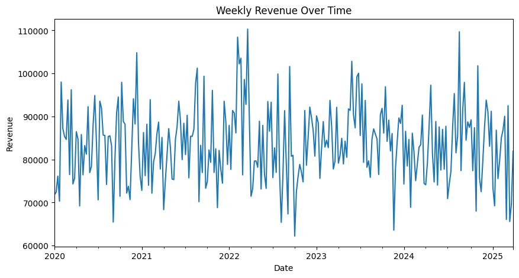
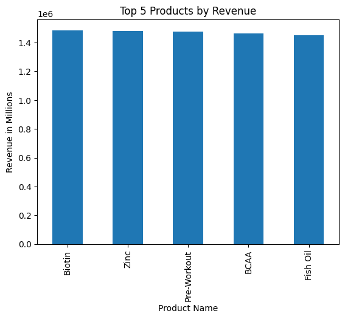
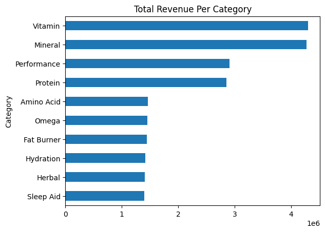
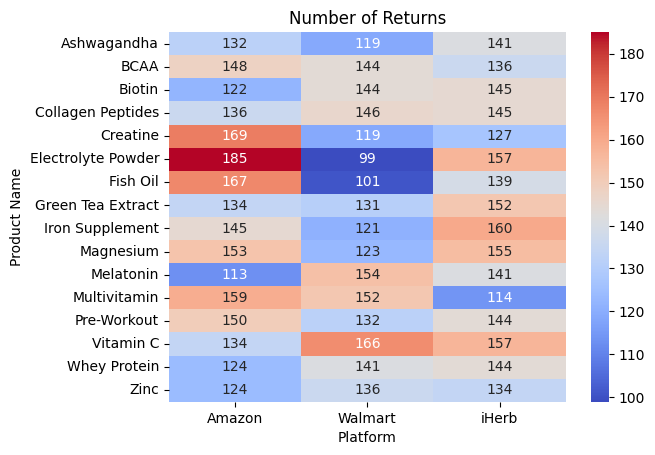
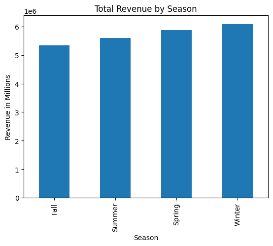
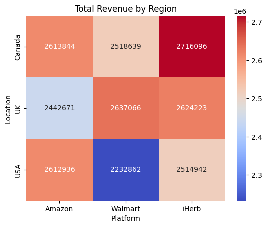

# Supplement Sales Analysis 
The dataset focuses on the weekly sales (starting on Janurary 2020) of various supplements through three vendors: Walmart, Amazon, and iHerb. 

We will analyze the dataset in order to answer the following questions:

 1. *How does the revenue look like over time?* 
 2. *What are the top 5 products in terms of revenue?* 
 3. *What are the total revenues for each category like?* 
 4. *Which items experience the highest returns? Does it differ across vendors?* 
 5. *Do certain seasons experience higher sales in supplements?* 
 6. *How is the distribution of sales across regions for each vendor like?* 
---
### Tools used:
- pandas
- numpy
- matplotlib
- seaborn

## Key Insights

### Revenue Drivers
- Vitamin and mineral supplements yield the highest revenue, followed by proteins and athlethic performance supplements 
- Their widespread use in addressing common deficiencies (e.g. vitamins A-K, magnesium, zinc) likely contributes to their popularity.

---

### Most Returned Products

**Amazon**
1. Creatine
2. Electrolytes
3. Fish oil

**Walmart**
1. Vitamin C
2. Melatonin
3. Multivitamins

**iHerb**
1. Iron
2. Electrolytes
3. Vitamin C

Return numbers vary by platform, but there are some common products like electrolytes and Vitamin C. This may suggest potential quality issues such as inaccurate dosages or unpleasant taste. 

--- 

### Seasonal Patterns ###
- Winter yields the highest average revenue, likely due to an increase in temperature and consequently a higher rate of sicknesses such as flu and common cold
- Customers may purchase more immune-boosting supplements such as Zinc and Vitamin C during colder months

### Regional Insights ###
- iHerb in Canada generates the highest revenue compared to other platforms
- Overall, Canada generates the most revenue. This could potentially be due to Canada experiencing colder temperatures on average compared to the US and UK 

---

## Business Suggestions to Improve Revenue 
- Investigate any potential quality control issues among the top returned products. Conduct purity tests to ensure the products contain the exact quantities as advertised. 


- Update product brandings: replace old, dated labels with updated visuals and graphics. Modern labels, clearer nutritional info and premium container textures can improve consumer perception. 


- Analyze customer reviews and return reasons (if any) to better understand reasons for customer dissatisfaction.


- Provide free samples of electrolyte powders as part of marketing campaign (like a free pack for every X purchase). This allows customers to freely try out the flavor of said powders and provide feedback. Adjust taste/flavor accordingly based on feedback.

## Loading Dataset and Data Cleaning


```python
# import relevant libraries
import pandas as pd
import numpy as np
import matplotlib.pyplot as plt
import seaborn as sns

# load dataset
df = pd.read_csv("Supplement_Sales_Weekly_Expanded.csv")
```


```python
# how many columns + rows dataset has
df.shape
```


    (4384, 10)


```python
# identify data type for each column
df.dtypes
```


    Date               object
    Product Name       object
    Category           object
    Units Sold          int64
    Price             float64
    Revenue           float64
    Discount          float64
    Units Returned      int64
    Location           object
    Platform           object
    dtype: object


```python
# identify any null values and how many per column
df.isnull().sum()
```


    Date              0
    Product Name      0
    Category          0
    Units Sold        0
    Price             0
    Revenue           0
    Discount          0
    Units Returned    0
    Location          0
    Platform          0
    dtype: int64


```python
# retrieve first 5 rows
df.head()
```


<div>

<table border="1" class="dataframe">
  <thead>
    <tr style="text-align: right;">
      <th></th>
      <th>Date</th>
      <th>Product Name</th>
      <th>Category</th>
      <th>Units Sold</th>
      <th>Price</th>
      <th>Revenue</th>
      <th>Discount</th>
      <th>Units Returned</th>
      <th>Location</th>
      <th>Platform</th>
    </tr>
  </thead>
  <tbody>
    <tr>
      <th>0</th>
      <td>2020-01-06</td>
      <td>Whey Protein</td>
      <td>Protein</td>
      <td>143</td>
      <td>31.98</td>
      <td>4573.14</td>
      <td>0.03</td>
      <td>2</td>
      <td>Canada</td>
      <td>Walmart</td>
    </tr>
    <tr>
      <th>1</th>
      <td>2020-01-06</td>
      <td>Vitamin C</td>
      <td>Vitamin</td>
      <td>139</td>
      <td>42.51</td>
      <td>5908.89</td>
      <td>0.04</td>
      <td>0</td>
      <td>UK</td>
      <td>Amazon</td>
    </tr>
    <tr>
      <th>2</th>
      <td>2020-01-06</td>
      <td>Fish Oil</td>
      <td>Omega</td>
      <td>161</td>
      <td>12.91</td>
      <td>2078.51</td>
      <td>0.25</td>
      <td>0</td>
      <td>Canada</td>
      <td>Amazon</td>
    </tr>
    <tr>
      <th>3</th>
      <td>2020-01-06</td>
      <td>Multivitamin</td>
      <td>Vitamin</td>
      <td>140</td>
      <td>16.07</td>
      <td>2249.80</td>
      <td>0.08</td>
      <td>0</td>
      <td>Canada</td>
      <td>Walmart</td>
    </tr>
    <tr>
      <th>4</th>
      <td>2020-01-06</td>
      <td>Pre-Workout</td>
      <td>Performance</td>
      <td>157</td>
      <td>35.47</td>
      <td>5568.79</td>
      <td>0.25</td>
      <td>3</td>
      <td>Canada</td>
      <td>iHerb</td>
    </tr>
  </tbody>
</table>
</div>


```python
# convert date to datetime from object type in order to use datetime functions 
df['Date'] = pd.to_datetime(df['Date'])
df.dtypes
```


    Date              datetime64[ns]
    Product Name              object
    Category                  object
    Units Sold                 int64
    Price                    float64
    Revenue                  float64
    Discount                 float64
    Units Returned             int64
    Location                  object
    Platform                  object
    dtype: object


## Exploratory Data Analysis


```python
# revenue trend over time by grouping the summed revenues by dates
revenue_trend = df.groupby('Date')['Revenue'].sum() 

# trend line plot
revenue_trend.plot(figsize=(10,5), title='Weekly Revenue Over Time', ylabel='Revenue')
```


    

    


```python
# top 5 selling products
top_products = df.groupby('Product Name')['Revenue'].sum().sort_values(ascending=False).head(5)
print(top_products)

# vertical bar chart 
top_products.plot(kind='bar', title='Top 5 Products by Revenue', ylabel='Revenue in Millions')

```

    Product Name
    Biotin         1486798.62
    Zinc           1482546.95
    Pre-Workout    1477183.78
    BCAA           1464819.63
    Fish Oil       1451065.87
    Name: Revenue, dtype: float64
    


    

    


```python
# total revenue for each category
category_revenue = df.groupby('Category')['Revenue'].sum().sort_values(ascending=True)
print(category_revenue)

# horizontal bar chart
category_revenue.plot(kind='barh', title='Total Revenue Per Category')
```

    Category
    Sleep Aid      1397315.79
    Herbal         1405700.79
    Hydration      1411951.38
    Fat Burner     1440900.05
    Omega          1451065.87
    Amino Acid     1464819.63
    Protein        2855492.09
    Performance    2909702.18
    Mineral        4276107.99
    Vitamin        4300224.68
    Name: Revenue, dtype: float64
    


    

    


```python
# create a heatmap of the total returns for each product across all three vendors
returns_heatmap = df.pivot_table(index='Product Name', columns='Platform', values='Units Returned', aggfunc='sum')
sns.heatmap(returns_heatmap, annot=True, fmt='.0f', cmap='coolwarm')
plt.title('Number of Returns')
```


    Text(0.5, 1.0, 'Number of Returns')


    

    


```python
# extract month 
df['Month'] = df['Date'].dt.month

# function to categorize each month from the date column
def get_season(month):
    if month in [12, 1, 2]:
        return 'Winter'
    elif month in [3, 4, 5]:
        return 'Spring'
    elif month in [6, 7, 8]:
        return 'Summer'
    elif month in [9, 10, 11]:
        return 'Fall'

# create a new column and call the get_season() function to retrieve corresponding season
df['Season'] = df['Month'].apply(get_season)


seasonal_revenue = df.groupby('Season')['Revenue'].sum().sort_values(ascending=True)

# bar chart
seasonal_revenue.plot(kind='bar', title='Total Revenue by Season', ylabel='Revenue in Millions')
```


    

    


```python
# sum up the revenue for each location + platform combo
region_vendor = df.pivot_table(index='Location', columns='Platform', values='Revenue', aggfunc='sum')
sns.heatmap(region_vendor, annot=True, fmt='.0f', cmap='coolwarm')
plt.title("Total Revenue by Region")

```


    

    

